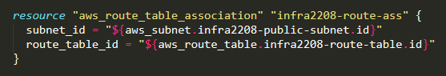

# Terraform-AWS-3
Terraform is an open-source tool created by **HashiCorp**. It is used for building, changing, and versioning infrastructure safely and efficiently. Terraform can manage existing and popular service providers as well as custom in-house solutions.  

#### Statement: 
We have to create a web portal for our company with all the security as much as possible.
So, we use Wordpress software with dedicated database server.
Database should not be accessible from the outside world for security purposes.
We only need to public the WordPress to clients.
So here are the steps for proper understanding!
* Write a Infrastructure as code using terraform, which automatically create a VPC.
* In that VPC we have to create 2 subnets:
     a)  public  subnet [ Accessible for Public World! ] 
     b)  private subnet [ Restricted for Public World! ]
* Create a public facing internet gateway for connect our VPC/Network to the internet world and attach this gateway to our VPC.
* Create  a routing table for Internet gateway so that instance can connect to outside world, update and associate it with public subnet.
* Launch an ec2 instance which has Wordpress setup already having the security group allowing  port 80 so that our client can connect to our wordpress site.
Also attach the key to instance for further login into it.
* Launch an ec2 instance which has MYSQL setup already with security group allowing  port 3306 in private subnet so that our wordpress vm can connect with the same.
Also attach the key with the same.   
**Note:** Wordpress instance has to be part of public subnet so that our client can connect our site. 
mysql instance has to be part of private  subnet so that outside world can't connect to it.
Don't forgot to add auto ip assign and auto dns name assignment option to be enabled.

Here I have created a infrastructure in **HCL (Hashicorp Configuration Language)** which consists of 
 
* Create a VPC.                                                                     

* Create a public subnet which auto-assign Public IP.                                          

* Create a private subnet.                                                           

* Create a Internet Gateway and attach it to VPC.                                          

* Create a routing table stating the route to Internet Gateway for the VPC.

* Associate the route table to the Public Subnet.                                            

* Create a Key to log in to the EC2 instance or to connect to it via SSH to run commands.

* Save the key locally for the further use.                                               

* Create a security group for the WordPress instance, and provide inbound and outbound rules.

* Create a security group for the MySQL instance, and provide inbound and outbound rules.

* Create an AWS instance, using WordPress AMI provided by Bitnami.                                   

* Create an AWS instance, using Amazon Linux 2 AMI (HVM) which already have MySQL installed.

* Launch the webpage on the CHROME using WordPress Instance Public_IP.              

### For reference 
[`Infrastructure.tf`](https://github.com/Sparsh-Agrawal/Terraform-AWS-3/blob/master/infra.tf)

[`LinkedIn`](https://www.linkedin.com/pulse/aws-infrastructure-using-terraform-iii-sparsh-agrawal)
